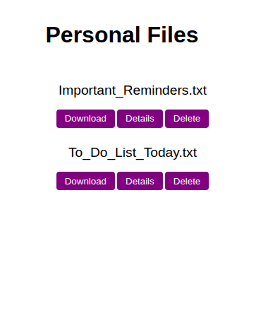

## file-uploader

## Odin Project NodeJS Course Project #5

## Table of Contents
* [Project Overview](#project-overview)
* [Live Demo](#live-demo)
* [Features](#features)
* [Tech Stack](#tech-stack)
* [Setup and Installation](#setup-and-installation)
* [Testing](#testing)
* [What I Learned](#what-i-learned)
* [Future Enhancements](#future-enhancements)
* [License](#license)

  ## Project Overview

  ## [Live Demo](file-uploader-aup0.onrender.com/)
  (Note: The live demo may experience a brief "cold start" due to hosting on a free service tier.)
  
  

  ## Features

  ## Tech Stack

  ## Setup and Installation

  ## Testing

  ## What I Learned

  ## Future Enhancements

  ## License
