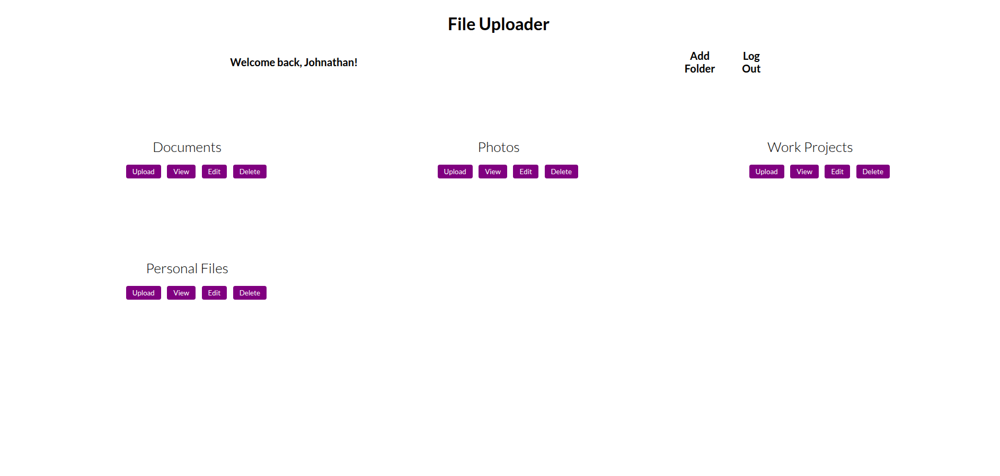

## file-uploader

## Odin Project NodeJS Course Project #5

## Table of Contents
* [Project Overview](#project-overview)
* [Live Demo](#live-demo)
* [Features](#features)
* [Tech Stack](#tech-stack)
* [Setup and Installation](#setup-and-installation)
* [Testing](#testing)
* [What I Learned](#what-i-learned)
* [Future Enhancements](#future-enhancements)
* [License](#license)

## Project Overview
  A full-stack file management application built as part of The Odin Project's Node.js course. This project allows users to securely manage files and folders with a focus on session-based authentication and CRUD operations.

  ## [Live Demo](file-uploader-aup0.onrender.com/)
  

  (Note: The live demo may experience a brief "cold start" due to hosting on a free service tier.)

## Features
  * __User Authentication__: Secure, session-based authentication using Passport.js with a local strategy.

  * __Account Management__: Allows users to create new accounts and log in securely.

  * __Folder Management__: Perform full Create, Read, Update, and Delete operations on folders.

  * __File Operations__: Upload, download, and delete files.

  * __File Details__: View metadata and details for each uploaded file.

  * __Cloud Storage__: Utilizes Supabase for reliable and scaleable file storage.

## Tech Stack
  ### Backend
  * __Node.js__: Server-side runtime environment.

  * __Express__: Web application framework for building the API and routing.

  * __Passport.js__: Middleware for handling user authentication.

  * __Prisma ORM__: A modern database toolkit for type-safe database access.

  ### Database & Storage
  * __Supabase__: A self-service backend platform used for both PostgreSQL database and cloud file storage.

  * __PostgreSQL__: The relational database used to store user and folder information.

  ### Frontend
  * __EJS__ (Embedded JavaScript): A simple templating language for generating dynamic HTML.

  ### Testing
  * __Jest__: A JavaScript testing framework for unit and integration tests.

  * __Supertest__: A library for testing HTTP requests and routes.

  ## Setup and Installation
  To get a copy of this project up and running on your local machine for development and testing purposes, follow these steps:

  ### Prerequisites
  You will need the following installed:
  
  * [Node.js](https://nodejs.org/en)
  * [npm](https://www.npmjs.com/)
  * An existing [Supabase](https://supabase.com/) project
  
  ### Environment Variables
  Create a .env file in the root directory of the project.

  Copy the contents of the .env.example file into your new .env file.
  
  Fill in the values with your credentials from your Supabase project.

  ``` bash
  # Supabase Database URL & Prisma Schema
  DATABASE_URL="postgresql://[USER]:[PASSWORD]@[HOST]:[PORT]/[DATABASE]"

  # Supabase Storage & Service Key
  SUPABASE_URL="https://your-project-id.supabase.co"
  SUPABASE_SERVICE_KEY="your-supabase-service-role-key"
  
  # Passport Session Secret
  SESSION_SECRET="a_secret_key"
  ```
  (Note: None of the environment variables should be shared publicly)

  ### Installation
  1. Clone the repository
  ``` bash
  git clone https://github.com/your-username/file-uploader.git
  cd file-uploader
  ```

  2. Install project dependencies
  ``` bash
  npm install
  ```
  
  3. Run Prisma migrations to setup database schema
  ``` bash
  npx prisma migrate dev
  ```

  4. Start the development server
  ``` bash
  npm start
  ```

  ## Testing

  ## What I Learned

  ## Future Enhancements

  ## License
